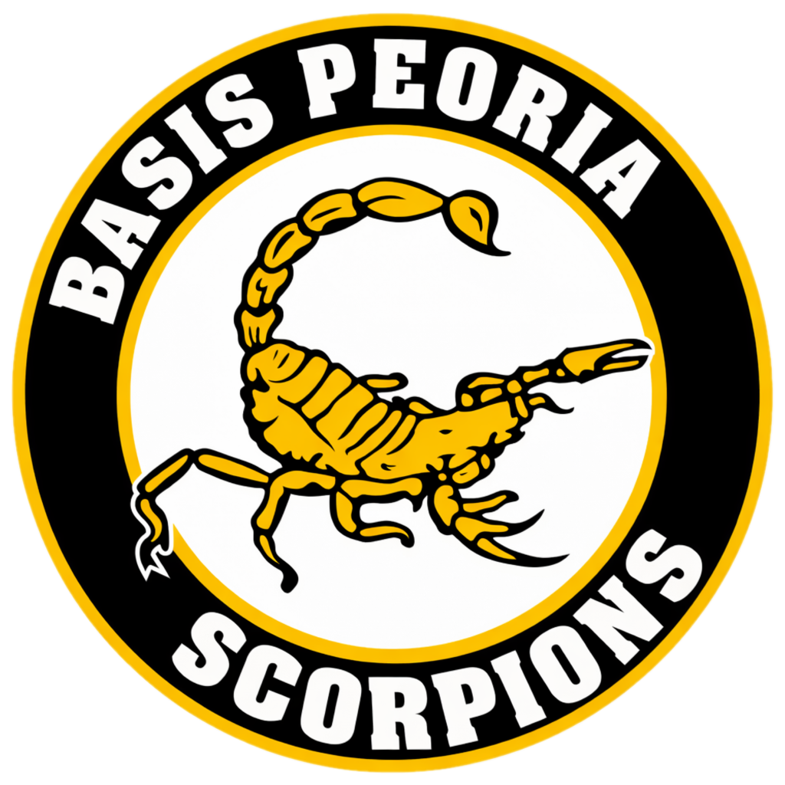

  

<h1 align="center">BASIS Peoria AP Library</h1>

  <strong>A free, open-source digital library providing quick access to AP course textbooks for BASIS Peoria students.</strong>

  
  

## About

The **BASIS Peoria** AP Library is a lightweight, client-side web application that organizes AP course textbooks into browsable categories. Students can quickly find, preview, and open textbook links all from a single interface.

Browse courses by subject area, search across all titles, select multiple resources at once, and toggle between light and dark modes, all designed to get students to the materials they need as fast as possible.

## Our Belief

Education and knowledge ought to be free. Access to learning materials should never be gated by cost, circumstance, or convenience. This project exists because we believe every student deserves unrestricted access to the resources that help them learn, grow, and succeed, regardless of background or means.

If a textbook can help a student understand the world a little better, nothing should stand between them and that knowledge.

## Developers

<table>
  <tr>
    <td align="center"><strong>Lucas Z</strong></td>
    <td align="center"><strong>Justin N</strong></td>
    <td align="center"><strong>Anish K</strong></td>
    <td align="center"><strong>Richard B</strong></td>
  </tr>
</table>

## License

This project is open source and available under the [MIT License](LICENSE).

